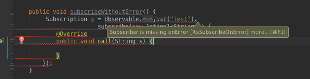

# README

`rxlint` is a set of lint checks that check your [RxJava][1] code. There are currently three checks.

### RxSubscribeOnError

Checks if a [RxJava][1] subscriber is handling the `onError()` callback. 

By default, [RxJava][1] will throw an `OnErrorNotImplemented` exception wrapped in an `IllegalStateException` for every error that is not handled for RxJava 1.x or will call the default uncaught exception handler directly if you are using RxJava 2.x before version 2.0.6.

When subscribing on a [Scheduler][2], like `Schedulers.io()` the error will be thrown on the scheduler thread and the stack trace will have no reference to the place where you subscribed.

TL;DR you should handle `onError`.

### RxLeakedSubscription

Checks that your code keeps a reference to a `Subscription` (rx 1.x) or `Disposable`. Not keeping a reference means that you can't `unsubscribe()` or `dispose()` at the appropriate times which might lead to memory leaks and crashes.

### RxDefaultScheduler

Checks if an RxJava 2.x operator is using a default scheduler. Operators like `delay()` do this. This can cause errors on 
Android in particular because a sequence like `observable.observeOn(mainThread()).delay(10, TimeUnit.SECONDS)` will emit the value on the 
default computation scheduler, and not the `mainThread()` scheduler like one might think. If the subscriber is accessing views on any other thread than the main thread, will throw
an exception at runtime. This check is a warning by default.
 
## Using

Adding `rxlint` to your project is easy, just add the following dependency to your `build.gradle`:

```
compile 'nl.littlerobots.rxlint:rxlint:<latest version>'
```

Once added to your project an error will be shown like this:



If you are calling `subscribe()` with a `Subscriber` (rx 1.x) or `DisposableXXXSubscriber` (rx 2.x) the subscriber is not checked for handling errors, assuming that you'll handle the errors properly.

### Ignoring errors

Use the `@SuppressLint("RxSubscribeOnError")` annotation, [lint.xml][3] or use `//noinspection AndroidLintCustomError`.
Refer to the [tools documentation on lint][3] for more info.

# License

```
/*
 *    Copyright 2016 Little Robots
 *
 *    Licensed under the Apache License, Version 2.0 (the "License");
 *    you may not use this file except in compliance with the License.
 *    You may obtain a copy of the License at
 *
 *        http://www.apache.org/licenses/LICENSE-2.0
 *
 *    Unless required by applicable law or agreed to in writing, software
 *    distributed under the License is distributed on an "AS IS" BASIS,
 *    WITHOUT WARRANTIES OR CONDITIONS OF ANY KIND, either express or implied.
 *    See the License for the specific language governing permissions and
 *    limitations under the License.
 */
```

[1]:https://github.com/ReactiveX/RxJava
[2]:http://reactivex.io/RxJava/javadoc/io/reactivex/schedulers/Schedulers.html
[3]:http://tools.android.com/tips/lint/suppressing-lint-warnings